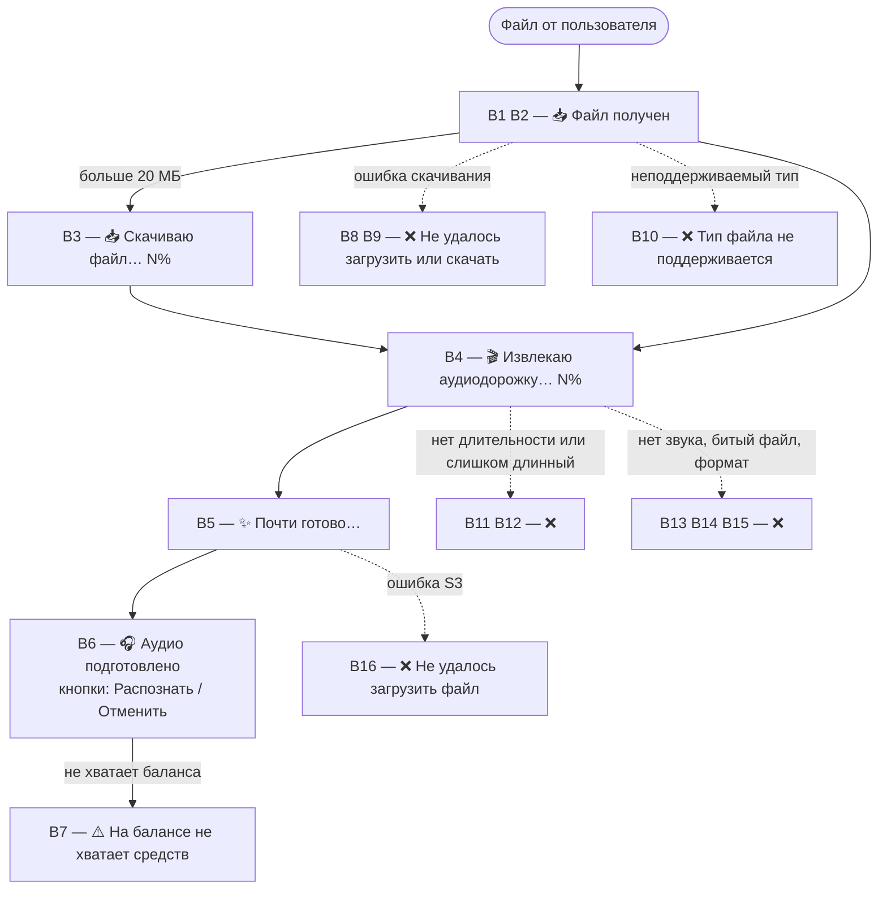
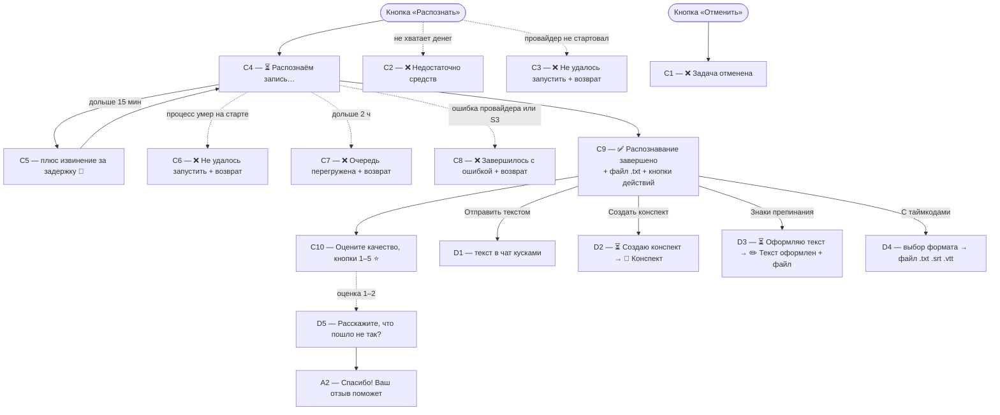
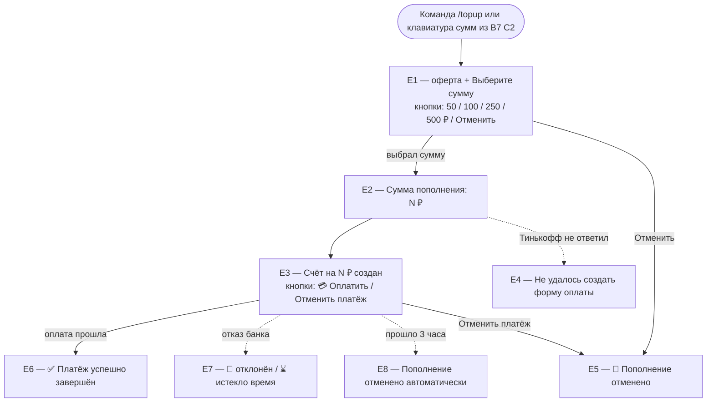

# Карта сообщений бота

Все тексты, которые видит пользователь, по этапам сценария. ID на схемах ведут в таблицы ниже.

Хендлеры зеркальны: каждый текст живёт в `handlers/telegram/…` и `handlers/max/…`, шедулеры (`schedulers/`) шлют в обе платформы. Отличия Max собраны в последнем разделе. Плейсхолдеры показаны как `{…}`. Найти текст в коде — grep по первым словам сообщения. Дословный текст сообщений — моноширинным, обычным шрифтом — пометки (кнопки, условия, варианты).

Актуально на 2026-06-10. При изменении текстов обновлять этот файл.

## Схема 1. Загрузка файла

## Схема 2. Распознавание и результат

## Схема 3. Пополнение баланса

## A. Онбординг и команды

| ID | Когда | Текст и кнопки |
|----|-------|----------------|
| A1 | Любое текстовое сообщение или /start. Новичку добавляется первая строка 🎁 (в TG «почти полтора часа» жирным) | `🎁 Подарили вам почти полтора часа распознавания бесплатно`  `Отправьте видео или аудио — вернём текст`  `Поддерживаем все популярные форматы:` `* Видео: mp4, mov, mkv, webm и другие` `* Аудио: mp3, m4a, wav, ogg/opus, flac и другие`  `Текущий баланс: {N} ₽` `Хватит на распознавание: {время}`  `Доступные команды:` `* /history — история распознаваний` `* /balance — текущий баланс` `* /topup — пополнить баланс` `* /price — стоимость` |
| A2 | Текст после низкой оценки (бот ждёт отзыв) | `Спасибо! Ваш отзыв поможет нам улучшить качество` |
| A3 | Фото, стикер и т.п. (только TG; в Max любое сообщение без файла отвечает A1) | `❌ Этот тип сообщения не поддерживается` `Пожалуйста, отправьте видео или аудио` |
| A4 | /history | `Последние 10 распознаваний:` `{🕓/⏳/✅/❌/🚫} {дата} МСК • {длит} • {цена}` …  `Статусы: 🕓 ожидание • ⏳ в работе • ✅ готово • ❌ ошибка • 🚫 отменено`  `Готовые тексты можно получить ещё раз:` Кнопки: `📄 {дата} • {длит}` |
| A4a | /history, записей нет | `История пуста`  `Пришлите видео или аудио — вернём текст` |
| A4b | Кнопка повторной отправки не смогла скачать текст | `Не удалось получить текст` `Попробуйте ещё раз чуть позже` |
| A5 | /balance | `Текущий баланс: {N} ₽` `Хватит на распознавание: {время}`  `Последние пополнения:` `{дата} — {N} ₽ — {статус}` (или `Пополнений пока нет`)  `Для пополнения баланса используйте команду /topup` |
| A6 | /price | `Стоимость распознавания`  `Цена — 0,01 ₽ за 1 секунду аудио, например:` `* 3 ₽ за 5 минут` `* 18 ₽ за 30 минут` `* 36 ₽ за 1 час`  `Минимальная стоимость одного распознавания — 1 ₽` |
| A7 | Только Max: переслали голосовое (вложение потерялось) | `⚠️ Пересланное голосовое не дошло`  `Max не передаёт ботам голосовые сообщения при пересылке.` `Отправьте голосовое или аудио боту напрямую — без «Переслать».` |

## B. Загрузка файла

После B6 сообщение-статус (B1–B5) удаляется. При ошибке оно остаётся рядом с текстом ошибки.

| ID | Когда | Текст и кнопки |
|----|-------|----------------|
| B1 | Файл ≤20 МБ принят | `📥 Файл получен`  `Подготавливаю аудио и считаю стоимость` `Это может занять до 1 минуты` |
| B2 | Файл >20 МБ принят | `📥 Файл получен ({размер} МБ/ГБ)`  `Скачиваю файл — обычно это занимает до {N} мин.` |
| B3 | Тикер скачивания, каждые 2 с | `📥 Скачиваю файл… {N}%`  `Осталось примерно {время}` |
| B4 | Извлечение аудио (стадия + тикер) | `🎬 Извлекаю аудиодорожку… {N}%`  `Осталось примерно {время}` |
| B5 | Загрузка в S3 | `✨ Почти готово…` |
| B6 | Аудио готово, ждём подтверждения. Заголовок жирный. При записи <5 мин добавляется 💡-строка | `🎧 Аудио подготовлено`  `Длительность: {время}` `Стоимость: {N} ₽`  `💡 Бот лучше всего работает с записями от 5 минут` Кнопки: `Распознать` `Отменить` |
| B7 | После B6, если баланса не хватает | `⚠️ На балансе не хватает средств` `Баланс: {X} ₽, стоимость: {Y} ₽`  `Пополните баланс и нажмите «Распознать»` Кнопки: суммы пополнения |
| B8 | TG: getFile упал (таймаут и т.п.) | `❌ Не удалось загрузить файл от Telegram` `Пожалуйста, попробуйте ещё раз` |
| B9 | Скачивание на диск не удалось | TG: `❌ Не удалось скачать файл` `Пожалуйста, попробуйте ещё раз` Max: `❌ Не удалось загрузить файл` `Пожалуйста, попробуйте ещё раз` (а если нет url: `❌ Не удалось получить файл от Max`) |
| B10 | MIME не поддерживается | `❌ Этот тип файла не поддерживается` `Пожалуйста, отправьте видео или аудио` |
| B11 | ffprobe не определил длительность | `❌ Не удалось определить длительность файла` `Возможно, формат не поддерживается или файл повреждён` |
| B12 | Дольше 6 часов | `❌ Файл слишком длинный: {время}` `Максимально допустимая длительность — 6 ч. 0 мин. 0 сек.` |
| B13 | В файле нет аудиодорожки | `❌ В этом файле не обнаружено аудио` `Пожалуйста, отправьте файл со звуком` |
| B14 | Обрезанная запись (moov atom) | `❌ Файл повреждён — запись была прервана и не сохранена до конца` `Попробуйте записать снова` |
| B15 | Прочие ошибки ffmpeg | `❌ Не удалось обработать файл` `Возможно, он имеет неподдерживаемый формат` |
| B16 | Загрузка в S3 не удалась | `❌ Не удалось загрузить файл` `Пожалуйста, попробуйте ещё раз чуть позже` |

## C. Распознавание

| ID | Когда | Текст и кнопки |
|----|-------|----------------|
| C1 | Кнопка «Отменить» по pending-задаче | `❌ Задача отменена`  `Длительность: {время}` `Стоимость: {N} ₽` |
| C2 | «Распознать» при нехватке денег (новое сообщение, кнопка остаётся) | `❌ Недостаточно средств` `Баланс: {X} ₽, требуется: {Y} ₽`  `Пополните баланс и нажмите «Распознать» ещё раз` Кнопки: суммы пополнения |
| C3 | Провайдер не принял задачу (деньги уже вернулись) | `❌ Не удалось запустить распознавание`  `Деньги вернули на баланс, попробуйте ещё раз чуть позже` |
| C4 | Задача запущена; шедулер обновляет каждые ~5 с | `⏳ Распознаём запись…`  `Длительность: {время}` `Стоимость: {N} ₽`  `Время обработки: {время}` |
| C5 | То же, спустя 15 мин без результата | + `Извините за задержку 🙏 Сейчас большая очередь, обработка идёт дольше обычного — мы продолжаем работать над вашим файлом, результат придёт.` |
| C6 | Зомби: процесс умер до записи operation_id (10 мин) | `❌ Не удалось запустить распознавание`  `Деньги вернули на баланс, попробуйте ещё раз` |
| C7 | Нет результата спустя 2 ч — задача снята | `❌ Не удалось распознать — очередь обработки перегружена`  `Деньги вернули на баланс, попробуйте ещё раз` |
| C8 | Провайдер вернул ошибку или результат не лёг в S3. Заголовок жирный | `❌ Распознавание завершилось с ошибкой`  `Деньги вернули на баланс, попробуйте ещё раз` |
| C9 | Результат готов. Заголовок жирный. При подозрении на шум добавляется ⚠️-абзац. Следом отдельным сообщением файл `{имя}.txt` | `✅ Распознавание завершено`  `Длительность: {время}` `Стоимость: {N} ₽`  `Время обработки: {время}`  `⚠️ Запись похожа на зашумлённую или неразборчивую — проверьте результат, распознавание может быть неточным` Кнопки: >5 мин — `📝 Создать конспект`, иначе `📄 Отправить текстом`; `⏱ С таймкодами` (whisperx); `✏️ Знаки препинания и абзацы` |
| C9a | Речи в записи нет — содержимое .txt | `(речь в записи отсутствует или слишком неразборчива для распознавания)` |
| C10 | Вслед за документом | `Оцените качество распознавания` Кнопки: 1⭐ … 5⭐ |
| C11 | Служебные ответы на битые/чужие кнопки | `Некорректная задача`, `Задача не найдена`, `Задача уже запущена`, `Задача уже обработана` |

## D. Действия с результатом

| ID | Когда | Текст и кнопки |
|----|-------|----------------|
| D1 | «📄 Отправить текстом»: текст в чат кусками по 4096. Если кусок не ушёл | `⚠️ Не удалось отправить текст целиком` `Нажмите «Отправить текстом» ещё раз чуть позже` (а если текст не скачался: `Не удалось получить текст`) |
| D2 | «📝 Создать конспект» | `⏳ Создаю конспект...`  `Время обработки: {время}` → `📝 Конспект`  `{текст конспекта}` (обрезка до 4096) или `❌ Не удалось создать конспект` |
| D3 | «✏️ Знаки препинания и абзацы» | `⏳ Оформляю текст...`  `Время обработки: {время}` → `✏️ Текст оформлен` + файл formatted.txt или `❌ Не удалось оформить текст` |
| D4 | «⏱ С таймкодами»: клавиатура заменяется выбором формата, после выбора приходит файл | Кнопки: `📄 .txt с таймкодами`, `🎬 .srt субтитры`, `🎞 .vtt`, `← Назад` Ошибки: `Не удалось получить таймкоды для этой расшифровки`, `В этой расшифровке нет данных с таймкодами`, `Не удалось отправить файл` |
| D5 | Оценка 1–2 ⭐ (тост на любую оценку: «Спасибо за оценку!») | `Расскажите, что пошло не так? Напишите пару слов — это поможет улучшить распознавание.` |

## E. Оплата

| ID | Когда | Текст и кнопки |
|----|-------|----------------|
| E1 | /topup или клавиатура сумм из B7/C2 | `Пополняя баланс, вы соглашаетесь с условиями публичной оферты и политикой обработки персональных данных` (ссылки)  `Безопасная оплата через Т‑Банк (Тинькофф):` `* Банковские карты (Visa, MasterCard, Мир)` `* Система быстрых платежей (СБП)`  `Выберите сумму пополнения` Кнопки: `50 ₽` `100 ₽` `250 ₽` `500 ₽` `Отменить` |
| E2 | Сумма выбрана (то же сообщение, последняя строка меняется) | … `Сумма пополнения: {N} ₽` |
| E3 | Счёт создан | `Счёт на {N} ₽ создан`  `Безопасная оплата через Т‑Банк (Тинькофф):` `* Банковские карты (Visa, MasterCard, Мир)` `* Система быстрых платежей (СБП)`  `Данные карты вводятся на стороне банка — бот их не видит` `После оплаты баланс пополнится автоматически` Кнопки: `💳 Оплатить` (ссылка), `Отменить платёж` |
| E4 | Тинькофф не создал платёж | `Не удалось создать форму оплаты` `Попробуйте ещё раз чуть позже` |
| E5 | «Отменить» / «Отменить платёж» | `🚫 Пополнение отменено` |
| E6 | Оплата подтверждена (клавиатура счёта снимается) | `✅ Платёж на {N} ₽ успешно завершён`  `Баланс: {N} ₽` `Хватит на распознавание: {время}` |
| E7 | Терминальный отказ Тинькофф (редактируется сообщение счёта) | `🚫 Платёж отклонён банком`, `🚫 Не удалось провести платёж`, `🚫 Платёж отменён`, `⌛ Время на оплату истекло`, иначе `🚫 Платёж не прошёл` |
| E8 | Счёт не оплачен 3 часа | `Пополнение отменено автоматически — прошло более 3 часов с момента создания` |
| E9 | Служебные ответы на битые/чужие кнопки | `Некорректная сумма пополнения`, `Сумма пополнения недоступна`, `Некорректные данные платежа`, `Платёж не найден`, `Платёж уже завершён ранее` |

## Отличия Max

* Жирные заголовки (B6, C8, C9) шлются с `format=html` и откатываются на плоский текст, если Max отверг HTML. В TG жирное надёжно через `parse_mode=HTML`.
* Приветствие A1: подарочная строка без жирного; A3 отсутствует — сообщение без файла всегда отвечает приветствием.
* A7 (пересланное голосовое) есть только в Max.
* B9: свои формулировки — «❌ Не удалось получить файл от Max» / «❌ Не удалось загрузить файл».
* B6 в Max — новое сообщение (не редактирование), затем статус-сообщение удаляется.
